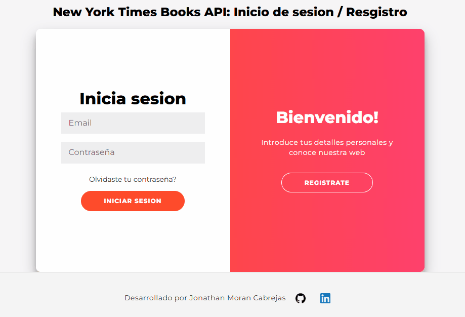
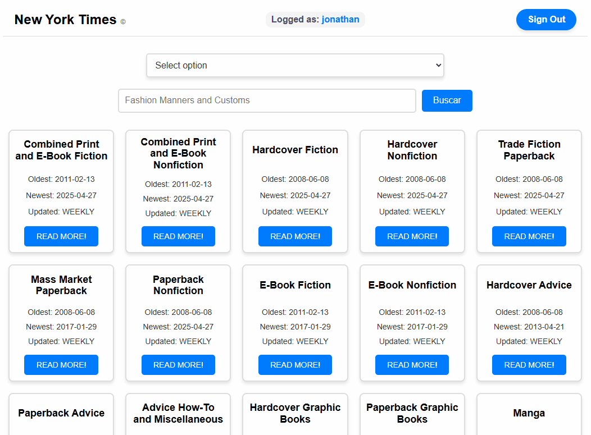
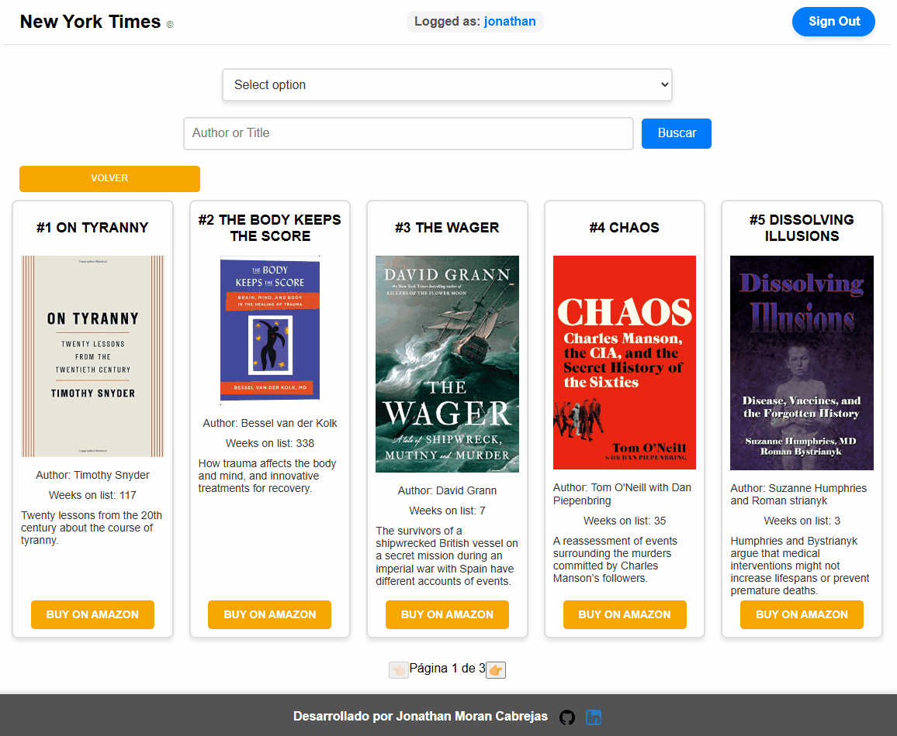

# 📚 NYT Books Explorer

**NYT Books Explorer** es una aplicación web interactiva que consume la API de libros del New York Times para ofrecerte una experiencia visual, rápida y cómoda de descubrimiento de libros por género. ¡Encuentra tus próximos libros favoritos y cómpralos directamente en Amazon!

## 🚀 Funcionalidades principales

- 🔗 Conexión con la **API del New York Times** para obtener los libros más vendidos por género.
- 🧭 **Visualización por géneros**: cada género se muestra como una tarjeta y puedes explorarlos individualmente.
- 🛒 **Enlaces directos a Amazon** para comprar cada libro fácilmente.
- 🔐 **Sistema de Login con autenticación de Firebase (Firestore Auth)**:
  - Registro e inicio de sesión con correo electrónico.
  - El usuario logueado se guarda en **LocalStorage** para mantener la sesión entre páginas.
  - Redirección automática y control de acceso según el estado de autenticación.
- 🧹 **Filtros avanzados**:
  - Orden alfabético por **autor**, **título** y **género**.
  - Orden por **fecha de publicación** (ascendente y descendente).
- 🔍 **Buscadores inteligentes**:
  - Búsqueda por **nombre de género**.
  - Búsqueda por **autor y título**.
- ✨ **Animaciones de carga** al aplicar filtros y búsquedas para mejorar la experiencia de usuario.
- 📱 **Diseño responsive y Mobile First**, optimizado para todos los dispositivos.
- 📄 **Paginación de resultados**:
  - Muestra una cantidad limitada de libros por página, de 5 en 5.
  - Navegación entre páginas mediante botones "Anterior" y "Siguiente".
  - Mejora el rendimiento y la legibilidad al manejar listas largas.

## 🌐 Acceso

Puedes acceder a la aplicación directamente desde GitHub Pages:

👉 https://jonha20.github.io/Biblioteca_API/pages/home.html

## 🧪 Tecnologías utilizadas

- **HTML5 / CSS3**
- **JavaScript (Vanilla o Framework, según implementación)**
- **Fetch API**
- **API New York Times Books**
- **Responsive Design con Flexbox / Media Queries**
- **Animaciones CSS o JavaScript**

<h2>👤 Inicio de sesión</h2>

<h2>🗂️ Página principal</h2>

<h2>📘 Detalle de libros</h2>

## 📄 Licencia

Este proyecto está licenciado bajo la [MIT License](LICENSE).